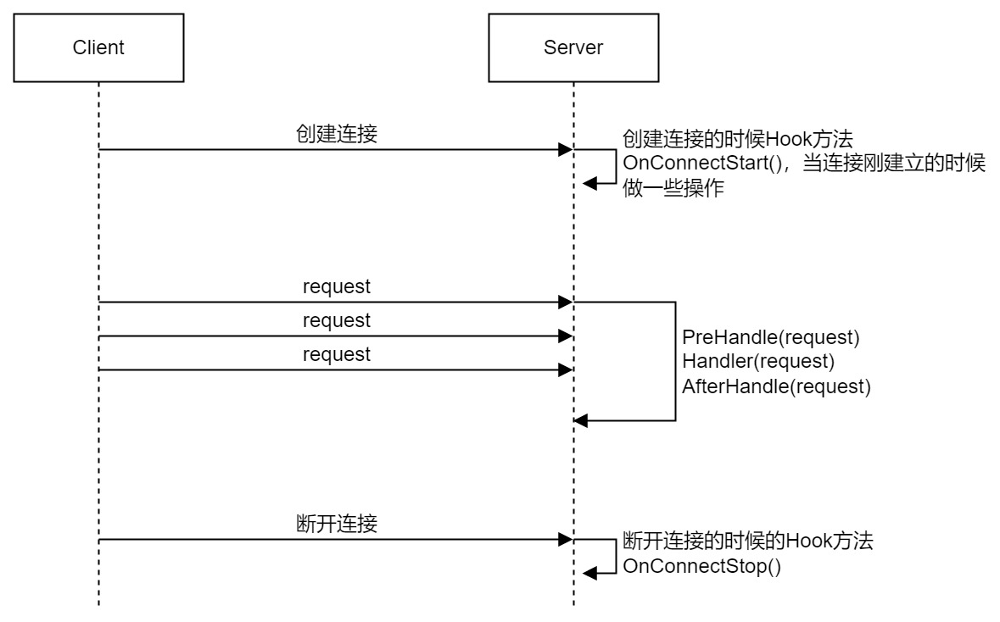

# 基于TCP的轻量级游戏服务端框架

> 结构参考：./mySource/struct.xmind

- 解决TCP粘包的问题：

    采用[head][body][head][body][head][body]...的形式

    [head]中包含DataLen(消息长度)和ID(消息ID)；
    [body]中包含的是具体的tcp数据。
    所以整个结构就是[Len][ID][Data][Len][ID][Data].....的形式
    

解决粘包示意图 (from 飞书文档)

- 解决请求的读写分离
    

读写分离示意图 (from 飞书文档)

- 多任务和消息队列处理
    

多任务和消息队列示意图 (from 飞书文档)

- Hook操作流程
  

Hook操作流程示意图示意图 (from 飞书文档)

  

